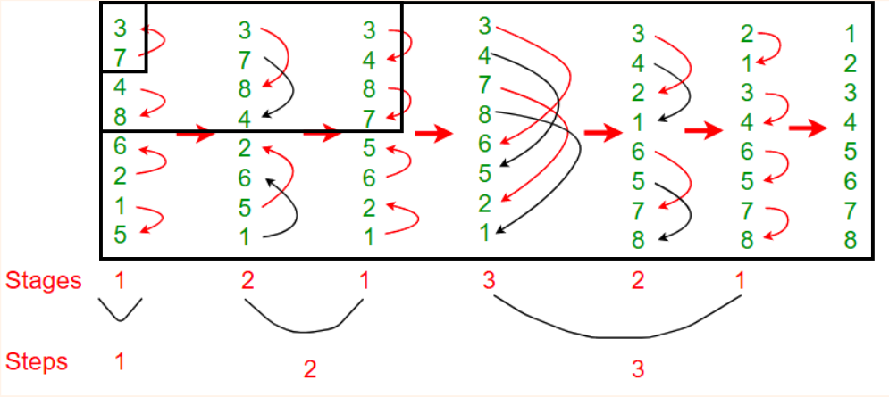
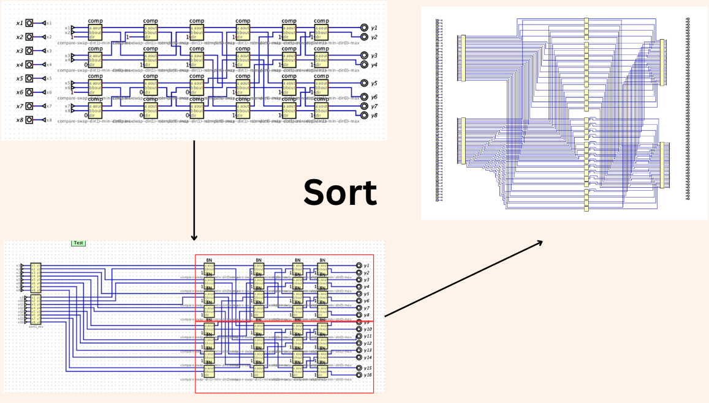

# bitonic sorting circuit
this repository is bitonic sorting implementation `(parallel-in parallel-out)` for input less than 512 `(n < 512)` , utilizing a circuit-based approach. 

This effort is a segment of the final project for `Digtal Logic Computer` subject (Foundation to Computer Engineering and Digital Technology)

The application from [Digital by hneemann](https://github.com/hneemann/Digital) is employed for this project.

# Bitonic Sort Overview


Bitonic Sort is a parallel sorting algorithm that's well-suited for hardware implementations, thereby potentially outperforming traditional sequential sorting algorithms in certain settings. Below is an outline of the Bitonic Sort operation:

## 1. Bitonic Sequence Generation:
- The initial step entails creating a Bitonic sequence -- a sequence of numbers which initially ascends, then descends.
- This is accomplished by recursively halving the input sequence, sorting one half in ascending and the other in descending order, subsequently merging them to form a Bitonic sequence.

## 2. Bitonic Split:

- Following the Bitonic sequence generation, a Bitonic Split is performed.
- During a Bitonic Split, the sequence is bifurcated, and corresponding elements from each half are compared. If an element in the first half is greater than the corresponding element in the second half, a swap occurs. This operation is concurrently executed for all pairs of corresponding elements.

## 3. Recursive Sorting:
Post Bitonic Split, two smaller Bitonic sequences are derived.
These sequences are then recursively sorted following the same methodology.

## 4. Combining:
- In the final step, the sorted sequences are amalgamated to yield a fully sorted sequence.

reference: https://www.geeksforgeeks.org/bitonic-sort/
## code
```cpp
#include <iostream>
#include <vector>

void compAndSwap(std::vector<int>& a, int i, int j, bool dir) {
    if (dir == (a[i] > a[j]))
        std::swap(a[i], a[j]);
}

void bitonicMerge(std::vector<int>& a, int low, int cnt, bool dir) {
    if (cnt > 1) {
        int k = cnt / 2;
        for (int i = low; i < low + k; i++)
            compAndSwap(a, i, i + k, dir);
        bitonicMerge(a, low, k, dir);
        bitonicMerge(a, low + k, k, dir);
    }
}

void bitonicSort(std::vector<int>& a, int low, int cnt, bool dir) {
    if (cnt > 1) {
        int k = cnt / 2;
        bitonicSort(a, low, k, true);
        bitonicSort(a, low + k, k, false);
        bitonicMerge(a, low, cnt, dir);
    }
}

int main() {
    std::vector<int> a = {34, 7, 23, 32, 5, 62, 32};
    int n = a.size();
    bitonicSort(a, 0, n, true);
    for (int i = 0; i < n; i++)
        std::cout << a[i] << " ";
    std::cout << std::endl;
    return 0;
}
```
# Implementation


we implement by created sorting for an input size n = 16 then up to n = 32, n = 64 ... , n = 512.

- Since bitonic is The recursive nature, it will be mirrored in our circuit design.
- At each stage, the circuits for the current input size were constructed by interconnecting the circuits from the previous stage, following the algorithm's recursive pattern of splitting, sorting, and merging.
- we saw that is `duplicated task`, so we create utility for rename it in utils [renaming tool](utils/xml_gen.py) for xml file by using `python` and [generate order number](utils/number.sh) from `shell script`

# installation
1. isntall java
2. run digital.jar
```bash
java -jar digital.jar
```
Noted: if can't run, you should install following https://github.com/hneemann/Digital


## Credit
- [punpun](https://github.com/punchanabu) co-worker